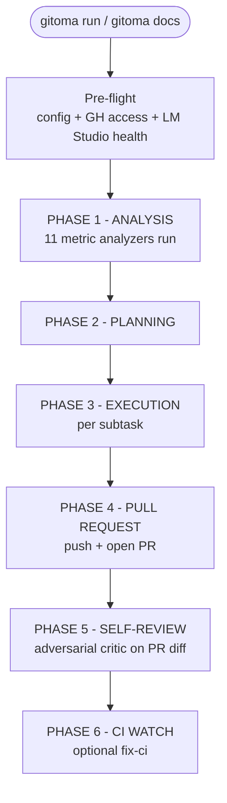
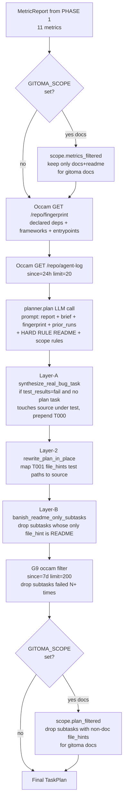
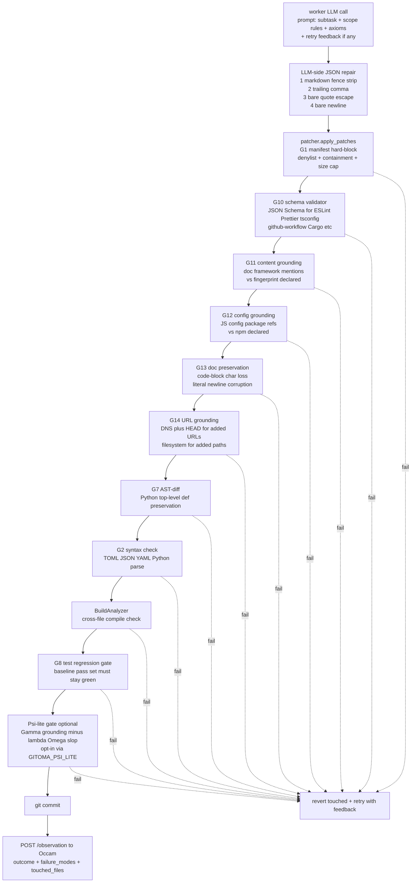
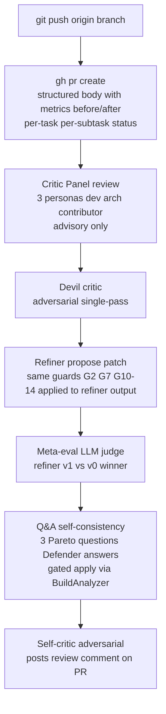
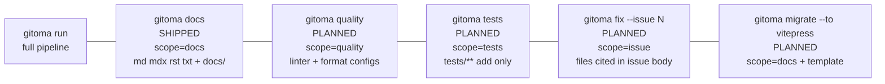
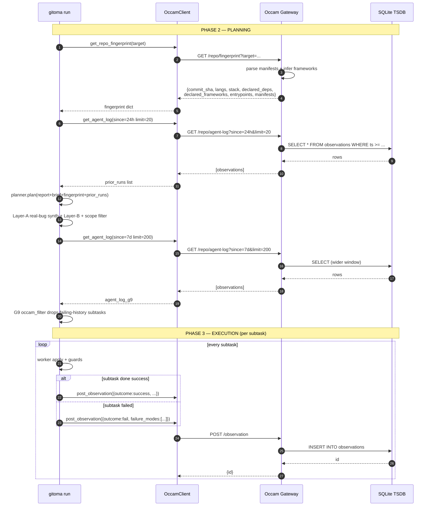

# Pipeline map (printable)

The full picture of `gitoma run` and its variants (`gitoma docs`,
future verticals), with every layer that sits between the LLM
output and a committed patch. Designed to be printed to one or
two pages and kept next to the keyboard.

## Top level



## PHASE 2 — Planning (deep)

The LLM planner is sandwiched between three deterministic layers.
Audit-side filter narrows what the planner sees; post-plan filters
clean what it emits.



## PHASE 3 — Worker apply pipeline (deep)

Per subtask, the worker calls the LLM, applies patches, then runs
each guard in order. Any guard fail = revert + retry with feedback.
Only after every guard passes does the patch commit.



## PHASES 4-5 — PR + critics



## Verticals (current + planned)

`GITOMA_SCOPE=<vertical>` activates audit + plan filters. Today
only `docs` is shipped; the others are planned with the same shape.



## Occam Observer — companion side

Occam is the optional ground-truth + cross-run learning gateway
gitoma consumes when `OCCAM_URL` is set. Three reads + one write
per gitoma run; everything else fail-open.

### Occam internals

```mermaid
flowchart TB
  subgraph Occam[Occam Observer process - Go]
    Gateway[HTTP Gateway port 9999<br/>FastAPI-equivalent in Go]

    subgraph Handlers[Coordination handlers]
      H1[/repo/fingerprint<br/>parse Cargo.toml package.json<br/>pyproject.toml go.mod<br/>infer frameworks from deps]
      H2[/repo/agent-log<br/>SELECT from observations<br/>filtered by since + limit + run_id]
      H3[/observation POST<br/>INSERT into observations<br/>closed-set outcome + failure_modes]
      H4[/repo/context<br/>git ls-files languages<br/>+ git log churn<br/>+ stable files]
      H5[/repo/blame /repo/churn<br/>git wrappers]
      H6[/file/imports /file/exports<br/>Python AST analyzer]
      H7[/claim<br/>multi-agent file lock]
    end

    subgraph Storage[Persistence]
      DB[(SQLite WAL<br/>observations table<br/>claims table)]
      State[/tmp/occam_state.json<br/>+ snapshots.db<br/>filesystem snapshots]
    end

    subgraph Engine[telemetry_observer.sh]
      Watcher[bash engine<br/>fswatch or inotify<br/>debounced file watcher]
    end

    Gateway --> H1
    Gateway --> H2
    Gateway --> H3
    Gateway --> H4
    Gateway --> H5
    Gateway --> H6
    Gateway --> H7

    H2 -->|read| DB
    H3 -->|write| DB
    H7 -->|read+write| DB

    H1 -->|read| Filesystem[(target repo<br/>read-only)]
    H4 -->|git CLI| Filesystem
    H5 -->|git CLI| Filesystem
    H6 -->|read| Filesystem

    Watcher -->|writes| State
    Gateway -->|spawns| Watcher
  end

  Client[gitoma client<br/>OccamClient.py] -->|HTTP| Gateway
```

### Per-run gitoma ↔ Occam wire (sequence)



### Occam endpoints — what gitoma uses + what's available

| Endpoint | Method | Used by gitoma | Returns |
|---|---|---|---|
| `/repo/fingerprint?target=` | GET | **planner prompt + G11/G12/G14 + Ψ-lite Γ** | snapshot dict |
| `/repo/agent-log?since=&limit=&run_id=&agent=` | GET | **planner prior-runs block + G9 filter** | list of observations |
| `/observation` | POST | **after every subtask outcome** | `{id}` |
| `/repo/context?target=` | GET | (available, not currently consumed) | langs + churn + stable files |
| `/repo/blame/<path>?target=` | GET | (available) | per-line blame + reverted_by |
| `/repo/churn/<path>?target=&since=` | GET | (available) | mods + reverts count |
| `/diff?target=&base=&branch=` | GET | (available) | ast_top_level_delta |
| `/file/fingerprint?path=` | GET | (available, file-level) | ast_hash + content_hash |
| `/file/imports?path=` | GET | (available, Python AST) | imports list |
| `/file/exports?path=` | GET | (available, Python AST) | exports list |
| `/symbol?path=&name=` | GET | (available) | signature + callers |
| `/agent/identity/<commit>` | GET | (available) | which agent committed |
| `/contract` | GET | (available) | gateway contract spec |
| `/claim` | GET/POST/DELETE | (available, multi-agent lock) | claim state |
| `/healthz` `/readyz` `/metrics` | GET | (operational) | liveness + Prometheus |

### Fail-open contract

Every `OccamClient` method returns a benign default on:
- HTTP timeout (2s default)
- Connection refused / DNS fail
- 4xx / 5xx response
- Schema mismatch (wrong shape)
- JSON parse error

Defaults: `None` for fingerprint/context, `[]` for agent-log, `None` for observation id. The gitoma pipeline NEVER raises because Occam is unavailable — the integration is purely additive.

## Layer reference table

| Layer | Lives in | Fires when | Action on fail |
|---|---|---|---|
| Audit metric filter | `planner/scope_filter.py` | `GITOMA_SCOPE` set | drop non-relevant metrics from MetricReport |
| Planner LLM call | `planner/planner.py` + `planner/llm_client.py` | always | retry with JSON repair, surface LLMError |
| Layer-A real-bug synth | `planner/real_bug_filter.py` | test_results.status == fail | prepend T000 task |
| Layer-2 test→source rewrite | `planner/test_to_source.py` | T001 file_hints all test files | rewrite hints to source |
| Layer-B README banish | `planner/real_bug_filter.py` | subtask file_hints == README only | drop subtask |
| G9 Occam filter | `planner/occam_filter.py` | subtask file_hints failed N+ times | drop subtask |
| Plan scope filter | `planner/scope_filter.py` | `GITOMA_SCOPE` set | drop non-scope subtasks |
| LLM JSON repair | `planner/llm_client.py` `_attempt_json_repair` | json.loads raises | strip fence + trailing comma + bare quote + bare newline |
| G1 manifest block | `worker/patcher.py` | manifest edit not in file_hints | reject patch |
| Patcher denylist + containment | `worker/patcher.py` | path in denylist or escapes root | reject patch |
| G10 schema validator | `worker/schema_validator.py` | file matches PATH_MATCHERS | revert+retry on schema fail |
| G11 content grounding | `worker/content_grounding.py` | doc file modified | revert+retry on framework mention not in fingerprint |
| G12 config grounding | `worker/config_grounding.py` | JS config file modified | revert+retry on npm ref not in package.json |
| G13 doc preservation | `worker/doc_preservation.py` | doc file modified | revert+retry on code-block loss or literal `\n` |
| G14 URL grounding | `worker/url_grounding.py` | doc file modified | revert+retry on added URL DNS/HEAD fail OR added path missing |
| G7 AST-diff | `worker/patcher.py` | Python file modified | revert+retry on top-level def missing |
| G2 syntax check | `worker/patcher.py` | always | revert+retry on parser error |
| BuildAnalyzer | `analyzers/build.py` | always | revert+retry on cross-file compile fail |
| G8 test regression | `worker/worker.py` | language has runner | revert+retry on previously-passing test now failing |
| Ψ-lite scoring + gate | `worker/psi_score.py` | `GITOMA_PSI_LITE=on` | revert+retry on Ψ < threshold |
| Critic Panel | `critic/panel.py` | always after commit | advisory only, never blocks |
| Devil critic | `critic/devil.py` | always after panel | advisory + feeds refiner |
| Refiner | `critic/refiner.py` | devil produced findings | re-emit patch, same guards as worker |
| Meta-eval judge | `critic/meta_eval.py` | refiner produced patch | choose v0 vs v1, no apply |
| Q&A self-consistency | `critic/qa.py` | always after meta-eval | apply revision gated by BuildAnalyzer |
| Self-critic | `review/self_critic.py` | after PR open | post review comment |

## Trace events emitted

| Event | When | Carries |
|---|---|---|
| `run.begin` | start of run | repo URL + branch + base |
| `run.exit_clean` | end of run | exit code |
| `scope.metrics_filtered` | docs vertical | kept + dropped metric names |
| `scope.plan_filtered` | docs vertical | dropped subtasks + reasons |
| `plan.real_bug_synthesized` | Layer-A fired | failing tests + source files |
| `plan.readme_banished` | Layer-B fired | dropped subtasks |
| `plan.occam_rewrite` | Layer-2 fired | before/after file_hints |
| `plan.occam_filter` | G9 fired | dropped subtasks + threshold |
| `worker.subtask.failed` | any subtask fail | task_id + subtask_id + error |
| `critic_syntax_check.fail` | G2 fired | path + error + phase |
| `critic_schema_check.fail` | G10 fired | path + error + phase |
| `critic_content_grounding.fail` | G11 fired | path + error + phase |
| `critic_config_grounding.fail` | G12 fired | path + error + phase |
| `critic_doc_preservation.fail` | G13 fired | path + error + phase |
| `critic_url_grounding.fail` | G14 fired | path + error + phase |
| `critic_ast_diff.fail` | G7 fired | path + missing defs |
| `critic_test_regression.fail` | G8 fired | failing tests + phase |
| `critic_build_retry.fail` | BuildAnalyzer fail | error + attempt |
| `critic_build_retry.success` | retry recovered | subtask_id + attempt |
| `psi_lite.scored` | Ψ-lite enabled | psi + weakest_file |
| `critic_psi_lite.fail` | Ψ-lite blocked | psi + weakest_file + reason |
| `critic_panel.review.end` | panel done | duration + findings_count + verdict |
| `critic_devil.review.end` | devil done | duration + findings_count |
| `critic_refiner.kept` | refiner kept | path |
| `critic_refiner.reverted` | refiner reverted | rationale |
| `critic_qa.crashed` | Q&A crashed | reason → PR body annotation |

## Operational env vars (cheat sheet)

| Variable | Default | Effect |
|---|---|---|
| `GITHUB_TOKEN` | required | fine-grained PAT with contents:write + pull-requests:write |
| `LM_STUDIO_BASE_URL` | `http://localhost:1234/v1` | LLM endpoint |
| `LM_STUDIO_MODEL` | `gemma-4-e2b-it` | model name |
| `LM_STUDIO_TIMEOUT` | `120` | per-call HTTP timeout, clamped 10-600 |
| `LM_STUDIO_DISABLE_THINKING` | unset | append `/no_think` (Qwen3 family) |
| `LM_STUDIO_DISABLE_THINKING_TEMPLATE_KWARG` | unset | send `chat_template_kwargs={enable_thinking:false}` (GLM/Gemma/vLLM) |
| `OCCAM_URL` | unset | Occam Observer gateway, fail-open if unreachable |
| `GITOMA_OCCAM_FILTER_THRESHOLD` | `2` | G9 drop threshold |
| `GITOMA_PSI_LITE` | unset | enable Ψ-lite gate |
| `GITOMA_PSI_LITE_THRESHOLD` | `0.5` | reject when Ψ below |
| `GITOMA_PSI_ALPHA` | `1.0` | Γ weight |
| `GITOMA_PSI_LAMBDA` | `1.0` | Ω weight |
| `GITOMA_URL_GROUNDING_OFFLINE` | unset | skip G14 DNS/HEAD (sandboxed CI) |
| `GITOMA_SCOPE` | unset | activate vertical mode (set by `gitoma docs`) |
| `CRITIC_PANEL_DEVIL` | off | enable devil critic |
| `CRITIC_PANEL_QA` | off | enable Q&A self-consistency |
| `CRITIC_PANEL_QA_APPLY_REVISION` | off | gate-apply Defender revision |
| `CRITIC_PANEL_DEVIL_BASE_URL` / `_MODEL` | inherit | route devil to a different endpoint |

## Printing

VS Code: open this file in preview, **Cmd-P → "Markdown PDF: Export (pdf)"** (install the `Markdown PDF` extension if missing).

Or via CLI with `mermaid-cli` + `pandoc`:

```bash
npm i -g @mermaid-js/mermaid-cli
brew install pandoc basictex
pandoc docs/architecture/pipeline-map.md -o pipeline-map.pdf \
  -F mermaid-filter \
  --pdf-engine=xelatex
```

The mermaid blocks render as embedded SVG. Layout is portrait A4
with the table sections naturally fitting one column each.
